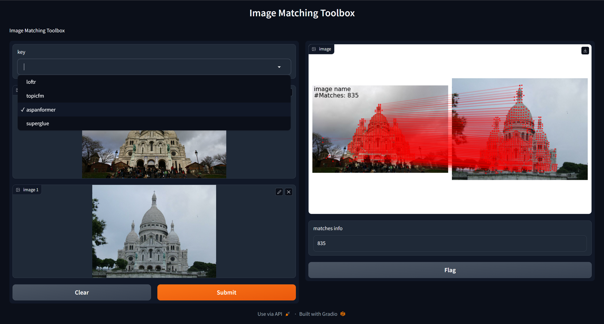

<p align="center">
  <h1 align="center"><br><ins>Image Matching WebGUI</ins><br>matching images with given images</h1> 
</p>

## Description

This simple tool efficiently matches image pairs using multiple famous image matching algorithms. The tool features a Graphical User Interface (GUI) designed using [gradio](https://gradio.app/). You can effortlessly select two images and a matching algorithm and obtain a precise matching result.


The tool currently supports various popular image matching algorithms, namely:
- [ ] [DeepLSD](https://github.com/cvg/DeepLSD), CVPR 2023
- [x] [GlueStick](https://github.com/cvg/GlueStick), ArXiv 2023
- [ ] [ConvMatch](https://github.com/SuhZhang/ConvMatch), AAAI 2023
- [x] [SOLD2](https://github.com/cvg/SOLD2), CVPR 2021
- [ ] [LineTR](https://github.com/yosungho/LineTR), RA-L 2021
- [x] [DKM](https://github.com/Parskatt/DKM), CVPR 2023
- [ ] [RoMa](https://github.com/Parskatt/RoMa), Arxiv 2023
- [ ] [NCMNet](https://github.com/xinliu29/NCMNet), CVPR 2023
- [x] [TopicFM](https://github.com/TruongKhang/TopicFM), AAAI 2023
- [x] [AspanFormer](https://github.com/apple/ml-aspanformer), ECCV 2022
- [ ] [LANet](https://github.com/wangch-g/lanet), ACCV 2022
- [ ] [LISRD](https://github.com/rpautrat/LISRD), ECCV 2022
- [ ] [REKD](https://github.com/bluedream1121/REKD), CVPR 2022
- [ ] [ALIKE](https://github.com/Shiaoming/ALIKE), ArXiv 2022
- [x] [SuperPoint](https://github.com/magicleap/SuperPointPretrainedNetwork), CVPRW 2018
- [x] [SuperGlue](https://github.com/magicleap/SuperGluePretrainedNetwork), CVPR 2020
- [x] [D2Net](https://github.com/mihaidusmanu/d2-net), CVPR 2019
- [x] [R2D2](https://github.com/naver/r2d2), NeurIPS 2019
- [x] [DISK](https://github.com/cvlab-epfl/disk), NeurIPS 2020
- [ ] [Key.Net](https://github.com/axelBarroso/Key.Net), ICCV 2019
- [ ] [OANet](https://github.com/zjhthu/OANet), ICCV 2019
- [ ] [SOSNet](https://github.com/scape-research/SOSNet), CVPR 2019
- [x] [SIFT](https://docs.opencv.org/4.x/da/df5/tutorial_py_sift_intro.html), IJCV 2004

## How to use

### requirements
``` bash
pip install -r requirements.txt
```
### run demo
``` bash
python3 ./main.py
```
then open http://localhost:7860 in your browser.



## Contributions welcome!

External contributions are very much welcome. Please follow the [PEP8 style guidelines](https://www.python.org/dev/peps/pep-0008/) using a linter like flake8. This is a non-exhaustive list of features that might be valuable additions:

- [ ] add more image matching algorithms with submodules
- [ ] add [line feature matching](https://github.com/Vincentqyw/LineSegmentsDetection) algorithms
- [ ] add config file to set default parameters

## Acknowledgement

This code is built based on [Hierarchical-Localization](https://github.com/cvg/Hierarchical-Localization). We express our gratitude to the authors for their valuable source code.