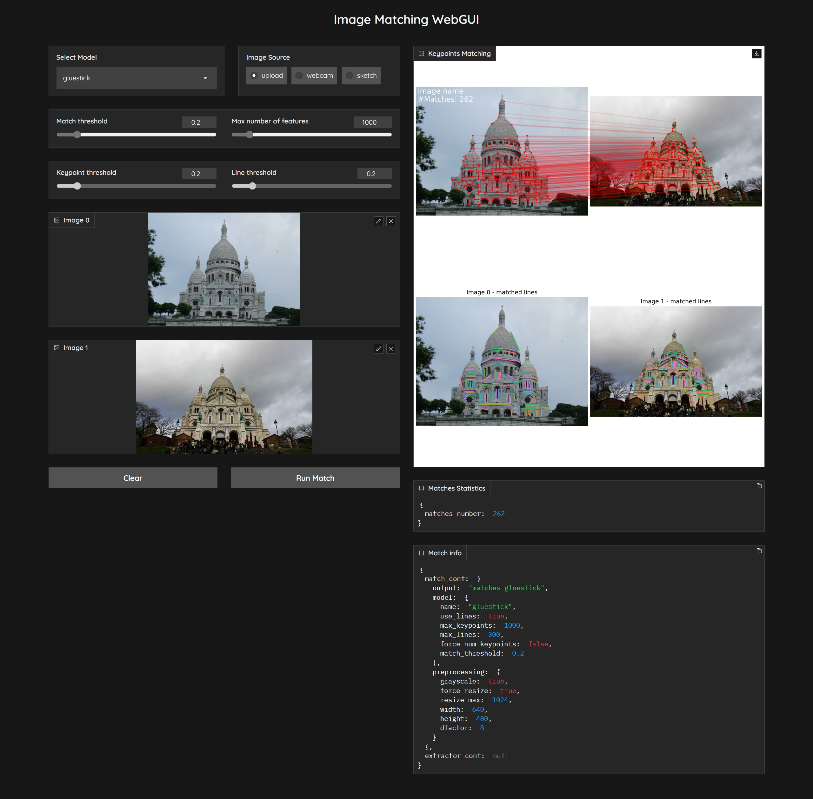

[![Contributors][contributors-shield]][contributors-url]
[![Forks][forks-shield]][forks-url]
[![Stargazers][stars-shield]][stars-url]
[![Issues][issues-shield]][issues-url]

<p align="center">
  <h1 align="center"><br><ins>$\color{red}{\textnormal{Image\ Matching\ WebUI}}$
</ins><br>Identify matching points between two images</h1> 
</p>

## Description

This simple tool efficiently matches image pairs using multiple famous image matching algorithms. The tool features a Graphical User Interface (GUI) designed using [gradio](https://gradio.app/). You can effortlessly select two images and a matching algorithm and obtain a precise matching result.
**Note**: the images source can be either local images or webcam images.

Try it on <a href='https://huggingface.co/spaces/Realcat/image-matching-webui'></a> 
<a target="_blank" href="https://lightning.ai/realcat/studios/image-matching-webui">
  
</a>

Here is a demo of the tool:

https://github.com/Vincentqyw/image-matching-webui/assets/18531182/263534692-c3484d1b-cc00-4fdc-9b31-e5b7af07ecd9

The tool currently supports various popular image matching algorithms, namely:
- [x] [XoFTR](https://github.com/OnderT/XoFTR), CVPR 2024
- [x] [EfficientLoFTR](https://github.com/zju3dv/EfficientLoFTR), CVPR 2024
- [x] [MASt3R](https://github.com/naver/mast3r), CVPR 2024
- [x] [DUSt3R](https://github.com/naver/dust3r), CVPR 2024
- [x] [OmniGlue](https://github.com/Vincentqyw/omniglue-onnx), CVPR 2024
- [x] [XFeat](https://github.com/verlab/accelerated_features), CVPR 2024
- [x] [RoMa](https://github.com/Vincentqyw/RoMa), CVPR 2024
- [x] [DeDoDe](https://github.com/Parskatt/DeDoDe), 3DV 2024
- [ ] [Mickey](https://github.com/nianticlabs/mickey), CVPR 2024
- [x] [GIM](https://github.com/xuelunshen/gim), ICLR 2024
- [x] [ALIKED](https://github.com/Shiaoming/ALIKED), ICCV 2023
- [x] [LightGlue](https://github.com/cvg/LightGlue), ICCV 2023
- [x] [DarkFeat](https://github.com/THU-LYJ-Lab/DarkFeat), AAAI 2023
- [x] [SFD2](https://github.com/feixue94/sfd2), CVPR 2023
- [x] [IMP](https://github.com/feixue94/imp-release), CVPR 2023
- [ ] [ASTR](https://github.com/ASTR2023/ASTR), CVPR 2023
- [ ] [SEM](https://github.com/SEM2023/SEM), CVPR 2023
- [ ] [DeepLSD](https://github.com/cvg/DeepLSD), CVPR 2023
- [x] [GlueStick](https://github.com/cvg/GlueStick), ICCV 2023
- [ ] [ConvMatch](https://github.com/SuhZhang/ConvMatch), AAAI 2023
- [x] [LoFTR](https://github.com/zju3dv/LoFTR), CVPR 2021
- [x] [SOLD2](https://github.com/cvg/SOLD2), CVPR 2021
- [ ] [LineTR](https://github.com/yosungho/LineTR), RA-L 2021
- [x] [DKM](https://github.com/Parskatt/DKM), CVPR 2023
- [ ] [NCMNet](https://github.com/xinliu29/NCMNet), CVPR 2023
- [x] [TopicFM](https://github.com/Vincentqyw/TopicFM), AAAI 2023
- [x] [AspanFormer](https://github.com/Vincentqyw/ml-aspanformer), ECCV 2022
- [x] [LANet](https://github.com/wangch-g/lanet), ACCV 2022
- [ ] [LISRD](https://github.com/rpautrat/LISRD), ECCV 2022
- [ ] [REKD](https://github.com/bluedream1121/REKD), CVPR 2022
- [x] [CoTR](https://github.com/ubc-vision/COTR), ICCV 2021
- [x] [ALIKE](https://github.com/Shiaoming/ALIKE), TMM 2022
- [x] [RoRD](https://github.com/UditSinghParihar/RoRD), IROS 2021
- [x] [SGMNet](https://github.com/vdvchen/SGMNet), ICCV 2021
- [x] [SuperPoint](https://github.com/magicleap/SuperPointPretrainedNetwork), CVPRW 2018
- [x] [SuperGlue](https://github.com/magicleap/SuperGluePretrainedNetwork), CVPR 2020
- [x] [D2Net](https://github.com/Vincentqyw/d2-net), CVPR 2019
- [x] [R2D2](https://github.com/naver/r2d2), NeurIPS 2019
- [x] [DISK](https://github.com/cvlab-epfl/disk), NeurIPS 2020
- [ ] [Key.Net](https://github.com/axelBarroso/Key.Net), ICCV 2019
- [ ] [OANet](https://github.com/zjhthu/OANet), ICCV 2019
- [x] [SOSNet](https://github.com/scape-research/SOSNet), CVPR 2019
- [x] [HardNet](https://github.com/DagnyT/hardnet), NeurIPS 2017
- [x] [SIFT](https://docs.opencv.org/4.x/da/df5/tutorial_py_sift_intro.html), IJCV 2004

## How to use

### HuggingFace / Lightning AI

Just try it on <a href='https://huggingface.co/spaces/Realcat/image-matching-webui'></a> 
<a target="_blank" href="https://lightning.ai/realcat/studios/image-matching-webui">
  
</a>

or deploy it locally following the instructions below.

### Requirements
``` bash
git clone --recursive https://github.com/Vincentqyw/image-matching-webui.git
cd image-matching-webui
conda env create -f environment.yaml
conda activate imw
```

or using [docker](https://hub.docker.com/r/vincentqin/image-matching-webui):

``` bash
docker pull vincentqin/image-matching-webui:latest
docker run -it -p 7860:7860 vincentqin/image-matching-webui:latest python app.py --server_name "0.0.0.0" --server_port=7860
```

### Deploy to Railway

Deploy to [Railway](https://railway.app/), setting up a `Custom Start Command` in `Deploy` section:

``` bash
python -m api.server
```
 
### Run demo
``` bash
python ./app.py
```
then open http://localhost:7860 in your browser.



### Add your own feature / matcher

I provide an example to add local feature in [hloc/extractors/example.py](hloc/extractors/example.py). Then add feature settings in `confs` in file [hloc/extract_features.py](hloc/extract_features.py). Last step is adding some settings to `matcher_zoo` in file [ui/config.yaml](ui/config.yaml).

## Contributions welcome!

External contributions are very much welcome. Please follow the [PEP8 style guidelines](https://www.python.org/dev/peps/pep-0008/) using a linter like flake8 (reformat using command `python -m black .`). This is a non-exhaustive list of features that might be valuable additions:

- [x] add [CPU CI](.github/workflows/ci.yml)
- [x] add webcam support
- [x] add [line feature matching](https://github.com/Vincentqyw/LineSegmentsDetection) algorithms
- [x] example to add a new feature extractor / matcher
- [x] ransac to filter outliers
- [ ] add [rotation images](https://github.com/pidahbus/deep-image-orientation-angle-detection) options before matching 
- [ ] support export matches to colmap ([#issue 6](https://github.com/Vincentqyw/image-matching-webui/issues/6))
- [ ] add config file to set default parameters
- [ ] dynamically load models and reduce GPU overload

Adding local features / matchers as submodules is very easy. For example, to add the [GlueStick](https://github.com/cvg/GlueStick): 

``` bash
git submodule add https://github.com/cvg/GlueStick.git third_party/GlueStick
```

If remote submodule repositories are updated, don't forget to pull submodules with:

``` bash
git submodule init
git submodule update --remote
```

if you only want to update one submodule, use `git submodule update --remote third_party/GlueStick`.

## Contributors

<a href="https://github.com/Vincentqyw/image-matching-webui/graphs/contributors">
  
</a>

## Resources
- [Image Matching: Local Features & Beyond](https://image-matching-workshop.github.io)
- [Long-term Visual Localization](https://www.visuallocalization.net)

## Acknowledgement

This code is built based on [Hierarchical-Localization](https://github.com/cvg/Hierarchical-Localization). We express our gratitude to the authors for their valuable source code.

[contributors-shield]: https://img.shields.io/github/contributors/Vincentqyw/image-matching-webui.svg?style=for-the-badge
[contributors-url]: https://github.com/Vincentqyw/image-matching-webui/graphs/contributors
[forks-shield]: https://img.shields.io/github/forks/Vincentqyw/image-matching-webui.svg?style=for-the-badge
[forks-url]: https://github.com/Vincentqyw/image-matching-webui/network/members
[stars-shield]: https://img.shields.io/github/stars/Vincentqyw/image-matching-webui.svg?style=for-the-badge
[stars-url]: https://github.com/Vincentqyw/image-matching-webui/stargazers
[issues-shield]: https://img.shields.io/github/issues/Vincentqyw/image-matching-webui.svg?style=for-the-badge
[issues-url]: https://github.com/Vincentqyw/image-matching-webui/issues
