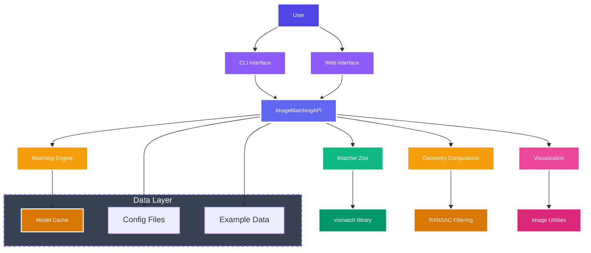

# Development

This section covers development setup, testing, and contributing to Image Matching WebUI.

## Development Installation

First, clone the repository and install in development mode:

```bash
git clone https://github.com/Vincentqyw/image-matching-webui.git
cd image-matching-webui
pip install -e .
```

For development with testing dependencies:

```bash
pip install -e .[dev]
```

## Running Tests

### Test Structure

The project uses pytest for testing. Tests are organized in the `tests/` directory.

### Running All Tests

```bash
pytest tests/ -v
```

### Running Specific Tests

```bash
# Run a single test
pytest tests/test_image_matching.py::test_one -v

# Run all tests in a file
pytest tests/test_api.py -v
```

### Test Coverage

```bash
pytest --cov=imcui tests/ --cov-report=html
```

## Pre-commit Hooks

The project includes pre-commit hooks for code quality checks:

```bash
# Install pre-commit hooks
pre-commit install

# Run hooks manually
pre-commit run -a
```

The hooks check for:
- Code formatting (ruff-format)
- Linting (ruff)
- Type checking (mypy)
- C++ formatting (clang-format)

## Code Quality Standards

### Python Code

- **Formatting**: Uses `ruff-format`
- **Linting**: Uses `ruff`
- **Type Checking**: Uses `mypy`

### C++ Code

- **Formatting**: Uses `clang-format`

## Adding New Features

### Steps for Adding Features

1. Create a feature branch
2. Implement your changes
3. Write tests for new functionality
4. Update documentation
5. Run all tests and pre-commit checks
6. Submit a pull request

### Branch Naming

Use descriptive branch names:

```bash
# Good
git checkout -b feat/add-ransac-optimization
git checkout -b fix/geometry-calculation-error
git checkout -b docs/update-installation-guide

# Avoid
git checkout -b feature-branch
git checkout -b my-branch
```

## Debugging

### Verbose Mode

Enable verbose output for debugging:

```bash
imcui --verbose
```

### Debug Logs

Logs are written to `log.txt` by default. Check this file for detailed error messages.

### Common Debugging Steps

1. Enable verbose mode
2. Check log outputs
3. Verify configuration files
4. Test with simple examples
5. Check GPU availability if using CUDA

## Contributing

### Contribution Guidelines

1. Follow the existing code style
2. Write tests for new functionality
3. Update relevant documentation
4. Ensure all tests pass
5. Get code review before merging

### Issue Reporting

When reporting issues, include:
- Operating system and version
- Python version
- Installed package versions
- Error messages and logs
- Steps to reproduce
- Expected vs actual behavior

### Pull Request Process

1. Fork the repository
2. Create a feature branch
3. Implement changes
4. Add tests and documentation
5. Run pre-commit checks
6. Submit pull request with clear description

## Architecture

### System Overview



### Project Structure

```mermaid
graph TD
    root[image-matching-webui] --> imcui[imcui/ - Python Package]
    root --> tests[tests/ - Test Suite]
    root --> cpp[cpp/ - C++ Implementation]
    root --> docs[docs/ - Documentation]
    root --> docker[docker/ - Deployment Config]

    imcui --> cli[cli/ - CLI Entry Point]
    imcui --> ui[ui/ - Web Interface]
    imcui --> api[api/ - Core API]
    imcui --> configFiles[config/ - Config Files]

    ui --> app[image_matching_app.py]
    ui --> config[config.py]
    ui --> configUtils[config_utils.py]
    ui --> matching[matching.py]
    ui --> geometry[geometry.py]
    ui --> imageUtils[image_utils.py]
    ui --> visualization[visualization.py]
    ui --> examples[examples.py]
    ui --> modelCache[model_cache.py]

    cli --> main[main.py]
    api --> server[server.py]
    api --> client[client.py]

    style root fill:#1F2937,stroke:#6366F1,stroke-width:3px,color:#ffffff,font-size:14px
    style imcui fill:#4F46E5,stroke:#ffffff,stroke-width:2px,color:#ffffff,font-size:12px
    style ui fill:#6366F1,stroke:#ffffff,stroke-width:2px,color:#ffffff,font-size:12px
    style api fill:#818CF8,stroke:#ffffff,stroke-width:2px,color:#ffffff,font-size:12px
    style cli fill:#8B5CF6,stroke:#ffffff,stroke-width:2px,color:#ffffff,font-size:12px
    style tests fill:#10B981,stroke:#ffffff,stroke-width:2px,color:#ffffff,font-size:12px
    style cpp fill:#F59E0B,stroke:#ffffff,stroke-width:2px,color:#ffffff,font-size:12px
    style docs fill:#EC4899,stroke:#ffffff,stroke-width:2px,color:#ffffff,font-size:12px
```



### Component Details

- `imcui/` - Main package
  - `cli/` - Command-line interface
  - `ui/` - User interface components
  - `api/` - Core API implementation
  - `config/` - Configuration files
- `tests/` - Test suite
- `cpp/` - C++ API implementation

### Key Components

- **ImageMatchingAPI**: Core matching API
- **ImageMatchingApp**: Gradio web interface
- **MatcherZoo**: Dynamic matcher loading
- **Visualization**: Result visualization utilities

## Release Process

### Version Management

Version is managed in `pyproject.toml`. Update the version number when preparing a release.

### Creating a Release

1. Update version in `pyproject.toml`
2. Ensure all tests pass
3. Update CHANGELOG.md
4. Create git tag: `git tag v1.0.0`
5. Push tag: `git push origin v1.0.0`
6. Build and publish to PyPI

## Resources

- **Project Repository**: https://github.com/Vincentqyw/image-matching-webui
- **Issues**: https://github.com/Vincentqyw/image-matching-webui/issues
- **Discussions**: https://github.com/Vincentqyw/image-matching-webui/discussions
- **Related Projects**:
  - [Vismatch](https://github.com/gmberton/vismatch) - Matcher collection library
