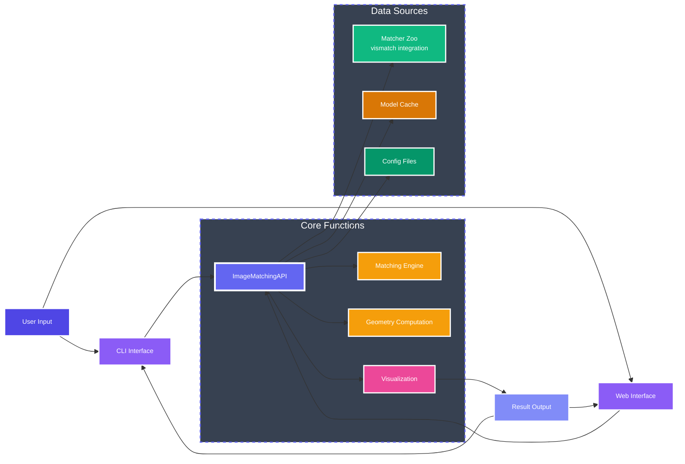

# Introduction

Image Matching WebUI (IMCUI) is a modern tool for matching image pairs using state-of-the-art computer vision algorithms. Built with Gradio, it provides an intuitive interface for both researchers and developers.

<Tip>
<strong>Ready to get started?</strong> Jump directly to our <a href="/docs/quickstart">Quick Start</a> to begin matching images in minutes.
</Tip>

## What It Does

IMCUI matches pairs of images to identify corresponding points and estimate geometric transformations. Built for:

- **Computer Vision Research**: Algorithm comparison and benchmarking
- **Image Processing**: Feature matching, image stitching, panorama creation
- **Education**: Learning modern matching algorithms through visualization
- **Development**: Integrating matching into applications

## Key Capabilities

### 🎯 Algorithm Diversity
Access 20+ matching algorithms through [vismatch](https://github.com/gmberton/vismatch) integration:
- **Sparse methods**: Feature-based matching with discrete keypoints
- **Dense methods**: Pixel-wise correlation matching
- **Hybrid approaches**: Combining multiple techniques

### 🖥️ User Experience
- **Modern web interface**: Intuitive Gradio-based UI
- **Real-time visualization**: See matches as they're computed
- **Flexible input**: Local files, webcam, or batch processing

### 🔧 Customization
- **YAML configuration**: Easy setup and sharing
- **Parameter tuning**: Adjust thresholds, RANSAC settings, more
- **GPU acceleration**: Support for CUDA-enabled systems

### 🚀 Integration
- **Complete API**: Programmatic access to all features
- **CLI tools**: Command-line automation
- **Extensible**: Add custom matchers and features

## Architecture

<Columns>
  <Card title="Matcher Zoo" icon="box">
    Dynamically loads algorithms from vismatch package
  </Card>
  <Card title="Core API" icon="code">
    Python API for programmatic matching
  </Card>
  <Card title="Web Interface" icon="monitor">
    Gradio-based UI for interactive use
  </Card>
  <Card title="Configuration" icon="sliders_horizontal">
    YAML-based setup and parameter management
  </Card>
</Columns>

## Getting Started

<Card
  title="Start Matching Images"
  icon="rocket"
  href="/docs/quickstart"
>
  Follow our three-step guide to install and start using Image Matching WebUI in minutes.
</Card>

## Technical Overview

### Matching Pipeline

1. **Feature Detection**: Identify keypoints in source images
2. **Feature Description**: Generate descriptors for each keypoint
3. **Feature Matching**: Find corresponding points between images
4. **Outlier Removal**: Use RANSAC to filter incorrect matches
5. **Geometry Estimation**: Compute transformation matrix
6. **Visualization**: Display matches and estimated geometry

### Supported Geometries

- **Homography**: Projective transformation for planar scenes
- **Fundamental Matrix**: Epipolar geometry for calibrated cameras
- **Essential Matrix**: Camera motion for calibrated stereo

### Algorithm Integration

All matching algorithms are maintained in the [vismatch](https://github.com/gmberton/vismatch) repository. New algorithms become automatically available as they're added.

## Performance

<CardGroup>
  <Card title="Speed" icon="zap">
    GPU-accelerated matching for large images
  </Card>
  <Card title="Accuracy" icon="check-circle">
    State-of-the-art algorithms with proven results
  </Card>
  <Card title="Simplicity" icon="heart">
    Easy to use for beginners, powerful for experts
  </Card>
</CardGroup>
---

## Project Resources

<CardGroup cols={2}>
  <Card title="Installation Guide" icon="download" href="/docs/installation">
    PyPI, Docker, source installation options
  </Card>
  <Card title="Configuration" icon="file-text" href="/docs/configuration">
    Customize matchers and parameters
  </Card>
  <Card title="Algorithm Reference" icon="list" href="/docs/models">
    Available matching algorithms
  </Card>
  <Card title="API Documentation" icon="code" href="/docs/api">
    Programmatic usage guide
  </Card>
</CardGroup>

## Community & Support

<Note>
<strong>Need Help?</strong> Visit our <a href="https://github.com/Vincentqyw/image-matching-webui/discussions">community discussions</a> or check the <a href="/docs/troubleshooting">troubleshooting guide</a> for common issues.
</Note>
