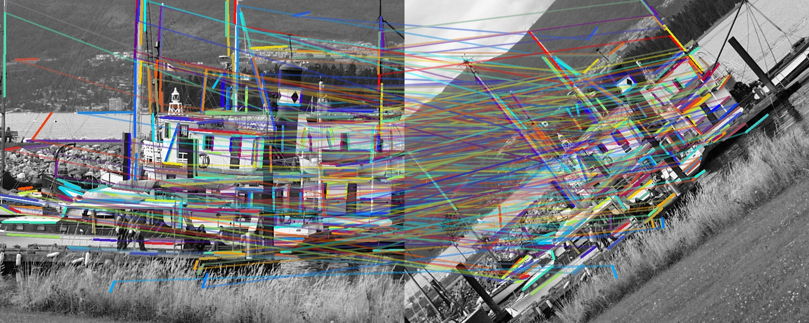

# pytlbd
Python transparent bindings for Line Band Descriptor

The repository contains a C++ implementation with python bindings of the method:

```
Zhang, L., & Koch, R. (2013). An efficient and robust line segment matching approach based on LBD descriptor 
and pairwise geometric consistency. Journal of Visual Communication and Image Representation, 24(7), 794-805.
```

The code is based on the original one provided by Lilian Zhang. The re-implementation substitute the computer 
vision library BIAS by OpenCV and uses modern C++14 structures instead of C ones. Optionally, ARPACK can be used to 
optimize the line matching part.  

### Download
```
git clone git@github.com:iago-suarez/pytlbd.git
cd pytlbd
git submodule update --init --recursive 
```

### Build

You need to have installed OpenCV in your system or rather modify the setup.py file to
include its installation directory.

```
sudo apt-get install libopencv-dev libopencv-contrib-dev libarpack++2-dev libarpack2-dev libsuperlu-dev
git clone --recursive https://github.com/iago-suarez/pytlbd.git
cd pytlbd
pip3 install -r requirements.txt
pip3 install .
```

To compile the C++ code:

```
cmake -DCMAKE_BUILD_TYPE=Release -DWITH_ARPACK=ON ..
make -j
```

- **Important NOTE**: C++ test do only work with versions of OpenCV up to 4.1.1. Newer versions contain changes image processing (mainly in the gaussian filtering) and will produce different results (still valid, but different). To use OpenCV 4.1.1 (in ubuntu 22.04) you can compile with:
```
cd MY_FAVORITE_DIR
git clone git@github.com:opencv/opencv.git -b 4.1.1 opencv-4.1.1
git clone git@github.com:opencv/opencv_contrib.git -b 4.1.1 opencv_contrib-4.1.1
sudo apt install build-essential cmake git libgtk2.0-dev pkg-config libavcodec-dev libavformat-dev libswscale-dev libtbb2 libtbb-dev libjpeg-dev libpng-dev libtiff-dev python3-pip python3-numpy
cd opencv-4.1.1 && mkdir build && cd build
cmake -D CMAKE_BUILD_TYPE=Release -D CMAKE_INSTALL_PREFIX=../install_release_dynamic -D BUILD_EXAMPLES=OFF -DBUILD_TESTS=OFF -DBUILD_PERF_TESTS=OFF -D INSTALL_PYTHON_EXAMPLES=OFF -D INSTALL_C_EXAMPLES=OFF -D OPENCV_EXTRA_MODULES_PATH=../../opencv_contrib-4.1.1/modules/ -D WITH_CUDA=OFF -D WITH_OPENGL=OFF -D WITH_OPENCL=OFF -D WITH_GSTREAMER=OFF -D WITH_EIGEN=OFF ..

# Now compile pytlbd with OpenCV-4.1.1
cmake -DCMAKE_BUILD_TYPE=Release -DWITH_ARPACK=ON -DOpenCV_DIR=MY_FAVORITE_DIR/opencv-4.1.1/install_release_dynamic/lib/cmake/opencv4 ..
# To do the same in the python wrapper, please edit the setup.py file
```


## Test

Once the library has been installed, you can check the examples for single scale segment detection and multi scale segment detection:

```
python3 tests/test_tlbd_singlescale.py
python3 tests/test_tlbd_multiscale.py
```


