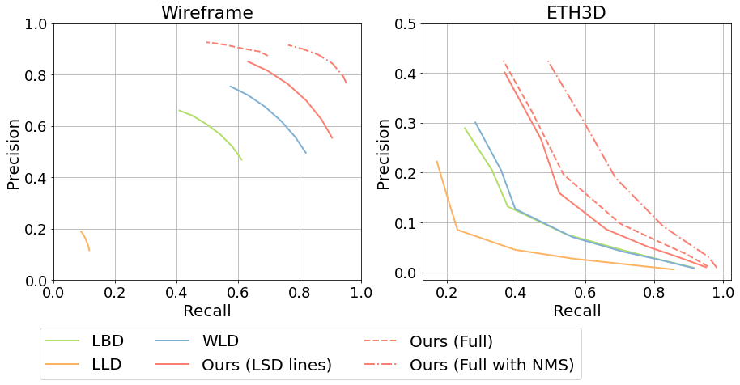

# SOLD² - Self-supervised Occlusion-aware Line Description and Detection

This repository contains the implementation of the paper: [SOLD² : Self-supervised Occlusion-aware Line Description and Detection](https://arxiv.org/abs/2104.03362), J-T. Lin*, R. Pautrat*, V. Larsson, M. Oswald and M. Pollefeys (Oral at CVPR 2021).

SOLD² is a deep line segment detector and descriptor that can be trained without hand-labelled line segments and that can robustly match lines even in the presence of occlusion.

## Demos

Matching in the presence of occlusion:


Matching with a moving camera:


## Usage

### Using from kornia

SOLD² is integrated into [kornia](https://github.com/kornia/kornia) library since version 0.6.7.

 ```
 pip install kornia==0.6.7
 ```

 Then you can import it as 
 ```python3
 from kornia.feature import SOLD2
 ```

 See tutorial on using SOLD² from kornia [here](https://kornia-tutorials.readthedocs.io/en/latest/line_detection_and_matching_sold2.html).

### Installation

We recommend using this code in a Python environment (e.g. venv or conda). The following script installs the necessary requirements with pip:
```bash
pip install -r requirements.txt
```

Set your dataset and experiment paths (where you will store your datasets and checkpoints of your experiments) by modifying the file `config/project_config.py`. Both variables `DATASET_ROOT` and `EXP_PATH` have to be set.

Install the Python package:
```bash
pip install -e .
```

You can download the version of the [Wireframe dataset](https://github.com/huangkuns/wireframe) that we used during our training and testing [here](https://www.polybox.ethz.ch/index.php/s/IfdEf7RoHol7jeg). This repository also includes some files to train on the [Holicity dataset](https://holicity.io/) to add more outdoor images, but note that we did not extensively test this dataset and the original paper was based on the Wireframe dataset only.

### Training your own model

All training parameters are located in configuration files in the folder `config`. Training SOLD² from scratch requires several steps, some of which taking several days, depending on the size of your dataset.

<details>
<summary><b>Step 1: Train on a synthetic dataset</b></summary>

The following command will create the synthetic dataset and start training the model on it:
```bash
python -m sold2.experiment --mode train --dataset_config sold2/config/synthetic_dataset.yaml --model_config sold2/config/train_detector.yaml --exp_name sold2_synth
```
</details>

<details>
<summary><b>Step 2: Export the raw pseudo ground truth on the Wireframe dataset with homography adaptation</b></summary>

Note that this step can take one to several days depending on your machine and on the size of the dataset. You can set the batch size to the maximum capacity that your GPU can handle. Prior to this step, make sure that the dataset config file `config/wireframe_dataset.yaml` has the lines `gt_source_train` and `gt_source_test` commented and you should also disable the photometric and homographic augmentations.
```bash
python -m sold2.experiment --exp_name wireframe_train --mode export --resume_path <path to your previously trained sold2_synth> --model_config sold2/config/train_detector.yaml --dataset_config sold2/config/wireframe_dataset.yaml --checkpoint_name <name of the best checkpoint> --export_dataset_mode train --export_batch_size 4
```

You can similarly perform the same for the test set:
```bash
python -m sold2.experiment --exp_name wireframe_test --mode export --resume_path <path to your previously trained sold2_synth> --model_config sold2/config/train_detector.yaml --dataset_config sold2/config/wireframe_dataset.yaml --checkpoint_name <name of the best checkpoint> --export_dataset_mode test --export_batch_size 4
```
</details>

<details>
 <summary><b>Step3: Compute the ground truth line segments from the raw data</b></summary>

```bash
python -m sold2.postprocess.convert_homography_results <name of the previously exported file (e.g. "wireframe_train.h5")> <name of the new data with extracted line segments (e.g. "wireframe_train_gt.h5")> sold2/config/export_line_features.yaml
```

We recommend testing the results on a few samples of your dataset to check the quality of the output, and modifying the hyperparameters if need be. Using a `detect_thresh=0.5` and `inlier_thresh=0.99` proved to be successful for the Wireframe dataset in our case for example.
</details>

<details>
 <summary><b>Step 4: Train the detector on the Wireframe dataset</b></summary>

We found it easier to pretrain the detector alone first, before fine-tuning it with the descriptor part.
Uncomment the lines 'gt_source_train' and 'gt_source_test' in `config/wireframe_dataset.yaml` and fill them with the path to the h5 file generated in the previous step.
```bash
python -m sold2.experiment --mode train --dataset_config sold2/config/wireframe_dataset.yaml --model_config sold2/config/train_detector.yaml --exp_name sold2_wireframe
```

Alternatively, you can also fine-tune the already trained synthetic model:
```bash
python -m sold2.experiment --mode train --dataset_config sold2/config/wireframe_dataset.yaml --model_config sold2/config/train_detector.yaml --exp_name sold2_wireframe --pretrained --pretrained_path <path ot the pre-trained sold2_synth> --checkpoint_name <name of the best checkpoint>
```

Lastly, you can resume a training that was stopped:
```bash
python -m sold2.experiment --mode train --dataset_config sold2/config/wireframe_dataset.yaml --model_config sold2/config/train_detector.yaml --exp_name sold2_wireframe --resume --resume_path <path to the  model to resume> --checkpoint_name <name of the last checkpoint>
```
</details>

<details>
 <summary><b>Step 5: Train the full pipeline on the Wireframe dataset</b></summary>

You first need to modify the field 'return_type' in `config/wireframe_dataset.yaml` to 'paired_desc'. The following command will then train the full model (detector + descriptor) on the Wireframe dataset:
```bash
python -m sold2.experiment --mode train --dataset_config sold2/config/wireframe_dataset.yaml --model_config sold2/config/train_full_pipeline.yaml --exp_name sold2_full_wireframe --pretrained --pretrained_path <path ot the pre-trained sold2_wireframe> --checkpoint_name <name of the best checkpoint>
```
</details>


### Pretrained models

We provide the checkpoints of two pretrained models:
- [sold2_synthetic.tar](https://www.polybox.ethz.ch/index.php/s/Lu8jWo7nMKal9yb): SOLD² detector trained on the synthetic dataset only.
- [sold2_wireframe.tar](https://www.polybox.ethz.ch/index.php/s/blOrW89gqSLoHOk): full version of SOLD² trained on the Wireframe dataset.
 
Note that you do not need to untar the models, you can directly used them as they are.


### How to use it

We provide a [notebook](notebooks/match_lines.ipynb) showing how to use the trained model of SOLD². Additionally, you can use the model to export line features (segments and descriptor maps) as follows:
```bash
python -m sold2.export_line_features --img_list <list to a txt file containing the path to all the images> --output_folder <path to the output folder> --checkpoint_path <path to your best checkpoint,>
```

You can tune some of the line detection parameters in `config/export_line_features.yaml`, in particular the 'detect_thresh' and 'inlier_thresh' to adapt them to your trained model and type of images. As the line detection can be sensitive to the image resolution, we recommend using it with images in the range 300~800 px per side.


## Results

Comparison of repeatability and localization error to the state of the art on the [Wireframe dataset](https://github.com/huangkuns/wireframe) for an error threshold of 5 pixels in structural and orthogonal distances:

 <table style="width:100%">
  <tr>
    <th></th>
    <th colspan="2">Structural distance</th>
    <th colspan="2">Orthogonal distance</th>
  </tr>
  <tr>
    <th></th>
    <th>Rep-5</th>
    <th>Loc-5</th>
    <th>Rep-5</th>
    <th>Loc-5</th>
  </tr>
  <tr>
    <td><a href="https://github.com/zhou13/lcnn">LCNN</a></td>
    <td>0.434</td>
    <td>2.589</td>
    <td>0.570</td>
    <td>1.725</td>
  </tr>
  <tr>
    <td><a href="https://github.com/cherubicXN/hawp">HAWP</a></td>
    <td>0.451</td>
    <td>2.625</td>
    <td>0.537</td>
    <td>1.725</td>
  </tr>
  <tr>
    <td><a href="https://github.com/yanconglin/Deep-Hough-Transform-Line-Priors">DeepHough</a></td>
    <td>0.419</td>
    <td>2.576</td>
    <td>0.618</td>
    <td>1.720</td>
  </tr>
  <tr>
    <td><a href="https://github.com/Siyuada7/TP-LSD">TP-LSD TP512</a></td>
    <td>0.563</td>
    <td>2.467</td>
    <td>0.746</td>
    <td>1.450</td>
  </tr>
  <tr>
    <td><a href="https://ieeexplore.ieee.org/abstract/document/4731268">LSD</a></td>
    <td>0.358</td>
    <td>2.079</td>
    <td>0.707</td>
    <td>0.825</td>
  </tr>
  <tr>
    <td><b>Ours with NMS</b></td>
    <td>0.557</td>
    <td><b>1.995</b></td>
    <td>0.801</td>
    <td>1.119</td>
  </tr>
  <tr>
    <td><b>Ours</b></td>
    <td><b>0.616</b></td>
    <td>2.019</td>
    <td><b>0.914</b></td>
    <td><b>0.816</b></td>
  </tr>
</table>

Matching precision-recall curves on the [Wireframe](https://github.com/huangkuns/wireframe) and [ETH3D](https://www.eth3d.net/) datasets:


## Bibtex

If you use this code in your project, please consider citing the following paper:
```bibtex
@InProceedings{Pautrat_Lin_2021_CVPR,
    author = {Pautrat*, Rémi and Lin*, Juan-Ting and Larsson, Viktor and Oswald, Martin R. and Pollefeys, Marc},
    title = {SOLD2: Self-supervised Occlusion-aware Line Description and Detection},
    booktitle = {Computer Vision and Pattern Recognition (CVPR)},
    year = {2021},
}
```
